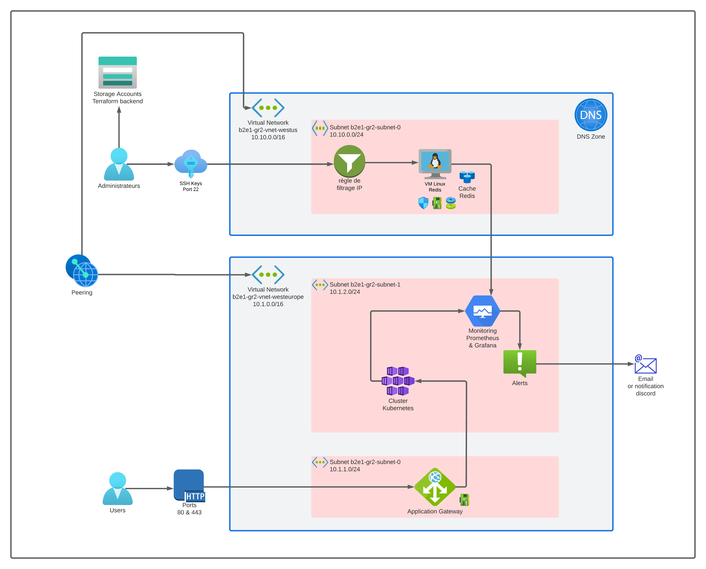

# b2e1-gr2
--------------------
### 0 - Prérequis

Avoir installé sur le poste :
- Terraform : version 1.5.4
- Python    : version 3
- Ansible   : version utilisée core [core 2.15.1]
- Helm      : version 3.12.3

--------------------
### Variables à changer

Dans le dossier ./Terraform => fichier locals.tf
Dans le dossier ./Terraform/backend => fichier locals.tf

Ajouter les clés publiques ssh dans le dossier ./Terraform/ssh_keys/

__Attention__ : Nommer la clé ssh de la même façon dans le fichier locals.tf (sans l'extension .pub)

--------------------
### 1 - Lancement de Terraform

On se place dans le dossier Terraform

Avant de lancer déploiement de l'infrasctructure, il faut déployer le backend distant pour Terraform

- Backend Terraform

on se place dans le dossier backend

    terraform init

    terraform apply

- Déploiement infrastructure

on revient dans le dossier Terraform (niveau -1)

    terraform init

    terraform apply


Si **terraform** est déjà déployé par un collègue, il faut lancer un **terraform apply** pour générer certains fichiers :

    terraform apply -target local_file.inventory -target local_file.admin_rsa_file -target local_sensitive_file.kube_config

---------------------


### Prometheus

On peut accéder au serveur Prometheus via le port 80 en utilisant le DNS :
**prometheus-server.monitoring.svc.cluster.local**


On peut également récupérer l'URL du serveur Prometheus via les commandes: 
    
    export POD_NAME=$(kubectl get pods --namespace default -l "app.kubernetes.io/name=prometheus,app.kubernetes.io/instance=prometheus" -o jsonpath="{.items[0].metadata.name}")
    
     kubectl --namespace default port-forward $POD_NAME 9090


### Grafana


 On peut récupérer le mot de passe du compte **admin** via la commande:
  
    kubectl get secret --namespace monitoring grafana -o jsonpath="{.data.admin-password}" | base64 --decode ; echo


 Le serveur Grafana peut être accéder via le port 80 en utilisant le dns

  **grafana.monitoring.svc.cluster.local**

  On peut également récuperer l'URL du serveur Grafana via les commandes:
     
     export POD_NAME=$(kubectl get pods --namespace monitoring -l "app.kubernetes.io/name=grafana,app.kubernetes.io/instance=grafana" -o jsonpath="{.items[0].metadata.name}")

     kubectl --namespace default port-forward $POD_NAME 3000

On peut ensuite se connecter via l'utilisateur **admin** et le mot de passe obtenu précedemment.

### Cert-manager

antoine@Antoine:~/b2e1-gr2$ helm install cert-manager jetstack/cert-manager --namespace cert-manager --version v1.7.1 --set installCRDs=true --create-namespace
NAME: cert-manager
LAST DEPLOYED: Mon Sep 25 12:05:28 2023
NAMESPACE: cert-manager
STATUS: deployed
REVISION: 1
TEST SUITE: None
NOTES:
cert-manager v1.7.1 has been deployed successfully!

In order to begin issuing certificates, you will need to set up a ClusterIssuer
or Issuer resource (for example, by creating a 'letsencrypt-staging' issuer).

More information on the different types of issuers and how to configure them
can be found in our documentation:

https://cert-manager.io/docs/configuration/

For information on how to configure cert-manager to automatically provision
Certificates for Ingress resources, take a look at the `ingress-shim`
documentation:

https://cert-manager.io/docs/usage/ingress/

---------------------
### Rancher

 helm install rancher rancher-latest/rancher --namespace cattle-system --set hostname=rancher.10.1.1.25.sslip.io --set replicas=1  --creat
e-namespace
NAME: rancher
LAST DEPLOYED: Mon Sep 25 12:14:49 2023
NAMESPACE: cattle-system
STATUS: deployed
REVISION: 1
TEST SUITE: None
NOTES:
Rancher Server has been installed.

NOTE: Rancher may take several minutes to fully initialize. Please standby while Certificates are being issued, Containers are started and the Ingress rule comes up.

Check out our docs at https://rancher.com/docs/

If you provided your own bootstrap password during installation, browse to https://rancher.10.1.1.25.sslip.io to get started.

If this is the first time you installed Rancher, get started by running this command and clicking the URL it generates:

```
echo https://rancher.10.1.1.25.sslip.io/dashboard/?setup=$(kubectl get secret --namespace cattle-system bootstrap-secret -o go-template='{{.data.bootstrapPassword|base64decode}}')
```

To get just the bootstrap password on its own, run:

```
kubectl get secret --namespace cattle-system bootstrap-secret -o go-template='{{.data.bootstrapPassword|base64decode}}{{ "\n" }}'
```


Happy Containering!
### 2 - Phase 2 - installation de Linteurs

Nous allons utiliser tflint, ansible lint et pre-commit 

#### Tflint
pour ceci, nous devons avoir unzip d'installé sur le poste.
Si ce n'est le cas : 

    sudo apt install unzip

le dépot du linteur est : https://github.com/terraform-linters/tflint

Dans le readme, il est indiqué d'installer le linteur avec la commande :

    curl -s https://raw.githubusercontent.com/terraform-linters/tflint/master/install_linux.sh | bash

Il faut créer un fichier .tflint.hcl dans le dossier Terraform dans lequel on configure les règles de vérification.

Pour lancer les commandes manuellement :

    tflint --init

    tflint --recursive

#### Ansible lint

installation d'Ansible Lint :

    pip3 install ansible-lint


---------------------

### Test

Pour la phase 1, nous pouvons tester le fonctionnement de Redis et de grafana

- Pour Redis, 
nous allons installer redis-tools en local :  
  sudo apt-get update
  sudo apt install redis-tools

Puis lancer la commande suivant afin de vérifier la communication avec le serveur Redis :
  redis-cli -h b2e1-gr2-vm.westus.cloudapp.azure.com PING

si la réponse est PONG, c'est gagné

- Pour Grafana,
nous allons récupérer les configurations du cluster avec la commande :
  az aks get-credentials --resource-group b2e1-gr2 --name b2e1-gr2-aks -f ~/.kube/config

nous allons ensuite récupérer le mot de passe de grafana :
  terraform output pass

Puis, connexion au serveur distant avec :
  kubectl port-forward svc/grafana 3000:80 --namespace="monitoring"

et avec un navigateur internet, nous allons sur la page :
  localhost:3000


---------------------

## Liste des ressources
- 1 **compte de stockage backend terraform** 		           (b2e1gr2******)
- 1 **clé ssh** créé aléatoirement + Clés admins supplémentaires (Antoine et Seb) 
- 2 **réseaux virtuels** 			           (b2e1-gr2-vnet-westeurope / westus) 
- 1 **sous-réseau** pour westus      (b2e1-gr2-subnet-0) 
- 1 **sous-réseau**	pour westeurope  (b2e1-sr2-subnet-0) 
- 1 **sous-réseau** pour westeurope  (b2e1-gr2-subnet-1) 
- 3 **NSG** 					           (b2e1-gr2-vm-nsg / b2e1-gr2-aks-nsg)
- 1 **VM Linux (Redis)** 		       (b2e1-gr2-vm) 
- 1 **Cluster Kubernetes (AKS)** 		(b2e1-gr2-aks) 
- 1 **Load balancer (gateway)**		       (b2e1-gr2-gateway) 
---------------------
## Topologie



## AAD POD IDENTITY
 helm install aad-pod-identity aad-pod-identity/aad-pod-identity
NAME: aad-pod-identity
LAST DEPLOYED: Wed Aug 30 10:20:25 2023
NAMESPACE: default
STATUS: deployed
REVISION: 1
TEST SUITE: None
NOTES:
You have successfully installed AAD Pod Identity in your Kubernetes cluster!

To verify that AAD Pod Identity has started in standard mode, run:
  kubectl --namespace=default get pods -l "app.kubernetes.io/component=mic"
  kubectl --namespace=default get pods -l "app.kubernetes.io/component=nmi"


Now you can follow the demos to get familiar with AAD Pod Identity: https://azure.github.io/aad-pod-identity/docs/demo/